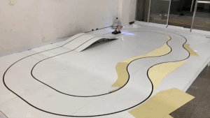
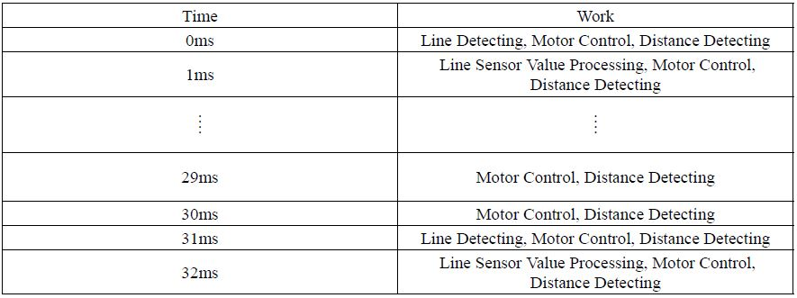

# 2019SmartCruiseCarContest

[단국대학교 MAZE](https://maze.co.kr) 단보르기니 팀 개발내용

개발 기간 : 2019.04 ~ 2019.08  

주관 : [한양대학교 Acelab](https://www.acelab.org/post/2019-%EC%A7%80%EB%8A%A5%ED%98%95-%EB%AA%A8%ED%98%95%EC%B0%A8-%EA%B2%BD%EC%A7%84%EB%8C%80%ED%9A%8C-%EA%B0%9C%EC%B5%9C)
후원 : Mathworks, Infineon

[개발완료 보고서 PDF](./PDF/2019_한양대지능형모형차대회_보고서.pdf)

## 팀원 구성

|팀원|맡은 역할|
|:---------:|:---:|
|[이진호 (팀장)](https://github.com/StylishPanther)| 전체 지휘 총괄 및 일정 조율, PID 제어기, 주행 알고리즘 설계 |
|[고승일]| Framework 기반 Firmware 설정  |
|[박찬희]| 장애물 회피 알고리즘 구현 |
|[김원석]|하드웨어 시뮬레이션 (Solidworks)| 
|[이장훈]|하드웨어 시뮬레이션 (Solidworks)|   

## 작품 목표    
 

1. Interrupt Scheduling을 통해서 안정적인 시스템 구현 
2. Line Scanning Camera 와 거리 센서에 Median Filter를 적용하여 안정적인 ADC값 추출  
3. Position 방식을 이용하여 곡률에 따른 좌, 우측 추종 정도 결정  
4. 속도 제한 구간(School Zone)에서 장애물 감지를 통한 차선 변경  
5. 정확한 속도 제어로 장애물과 충돌하지 않고 정지(AEB 구현)

 

## 동작 영상  

- [대회 영상 링크](https://www.youtube.com/watch?v=flaqk12rfIE)

 

  

 < Lane Keeping System 테스트 (Velocity : 1200mm/s) >
  

  

 < Obstacle Avoidance & School Zone AEB 테스트 (Velocity : 1000mm/s) >

  

 < Roburtness for Driving Environment (Light) 테스트 (Velocity : 1000mm/s)>

 

 
  

 < Autonomotive Car ( Width : 300mm Column : 450mm Height : 300mm ) >
  

## 작품 설명  

### 하드웨어 품목  

|Hardware Type|Model Name|Datasheet|  
|:---:|:---:|:---:|
|CPU|Infineon TC27x|[PDF](./PDF/Infineon-tc27xD_usermanuel.pdf)|  
|Line Scan Camera|TSL1401-DB|[PDF](./PDF/tsl1401-db_manual.pdf)|  
|Infrared Distance Sensor|GP2Y0A02|[PDF](./PDF/GP2Y0A02YK.pdf)|  
|Motor Driver|IFX007T|[PDF](./PDF/Infineon-Motor_Control_Shield_with_IFX007T.pdf)|    
|Motor|RS540SH|[PDF](./PDF/RS_540SH_DATASHEET.pdf)|  
|Encoder|30S4-1024-6-L-5|[PDF](./PDF/E30S_series_37mnyih3.pdf)|
|Regulator|LM2576, TLE4271-2|[PDF](./PDF/TLE4271-2.pdf), [PDF](./PDF/LM2576_datasheet.pdf)|
|VFD|HCMS-2912|[PDF](./PDF/hcms_2912.pdf)|

### SDK

|SDK|Description|  
|:---:|:---:|  
|AruixTutorial| AurixRacer 튜토리얼|
|_iLLD_Framework_SB_TC27D|기본 프로젝트 Framework|  
 
## Software Architecture

### Debuging Environment

 자율주행 알고리즘 개발의 편의를 위하여 Infineon 사에서 제공하는 Framework를 기반으로 VFD를 이용해서 디버깅환경을 구축했다. 별도의 통신을 하지 않고, 초기 설정에서 Menu를 구현해 Sensor, Encoder, Line Tracking, Servo Motor, Velocity를 관리 할 수 있게 했다.

### Interrupt Scheduler
자율주행 알고리즘을 개발하면서 가장 핵심이 되는 부분은 Interrupt Scheduler 설계이다. 
Interrupt를 1ms Cycle로 하면서 구동부, 조향부, 센서부 제어를 안정적으로 하면서 다음 인터럽트에 영향을
미치는 Pending 현상을 방지하기 위해서 처리 시간까지 감안하여 자체적으로 설계를 하였다.

 
<!--

 

### Line Camera Signal Processing

Line Camera 로 받은 128개의 Pixel 값을 Median Filtering을 통해서 Ripple Noise를 제거 하였다.
검은색과 흰색의 명확한 값 차이를 주기 위해서 라인을 놓치지 않는 선에서 센서값을 주는 시간에 일
정 시간 Delay를 주어서 보다 명확하게 값을 인식하게 하였다. 환경에 따라서 값이 달라질 수 있는 가
능성을 고려하여 128개의 Pixel 중에 가운데 100개의 Pixel을 추출했다.

## System Architecture  

 

 
-->

## Reference
- [AurixRacer](./docs/index.md)
- [AurixRacer Source Code](https://github.com/realsosy/AurixRacer/)
- [AurixRacer Documentation](http://aurixracer.readthedocs.io/ko/latest/) 
- [AurixTutorial Source Code](https://github.com/realsosy/AurixTutorial/)
- [AurixTutorial Documentation](http://aurixtutorial.readthedocs.io/ko/latest/) 

